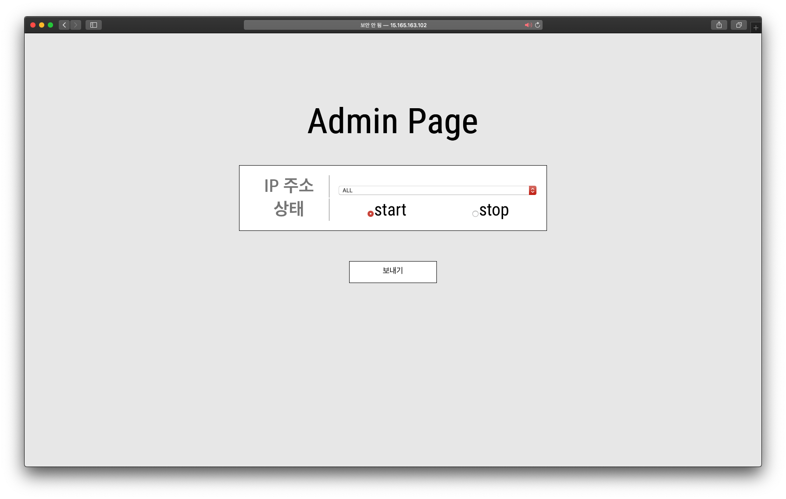
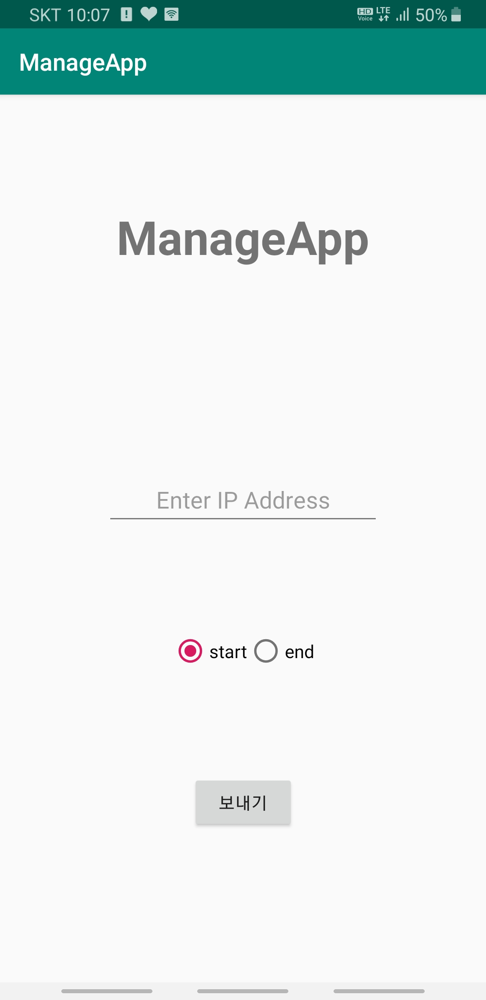
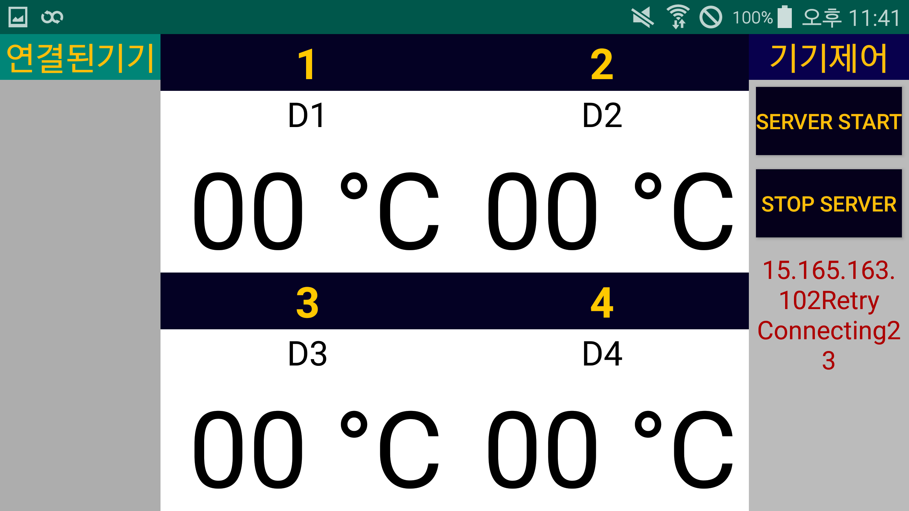
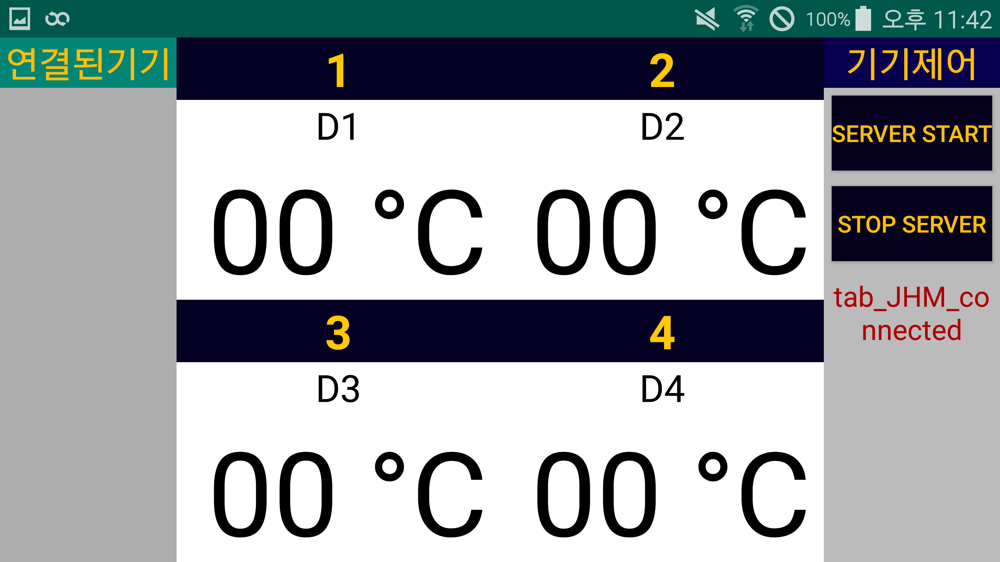
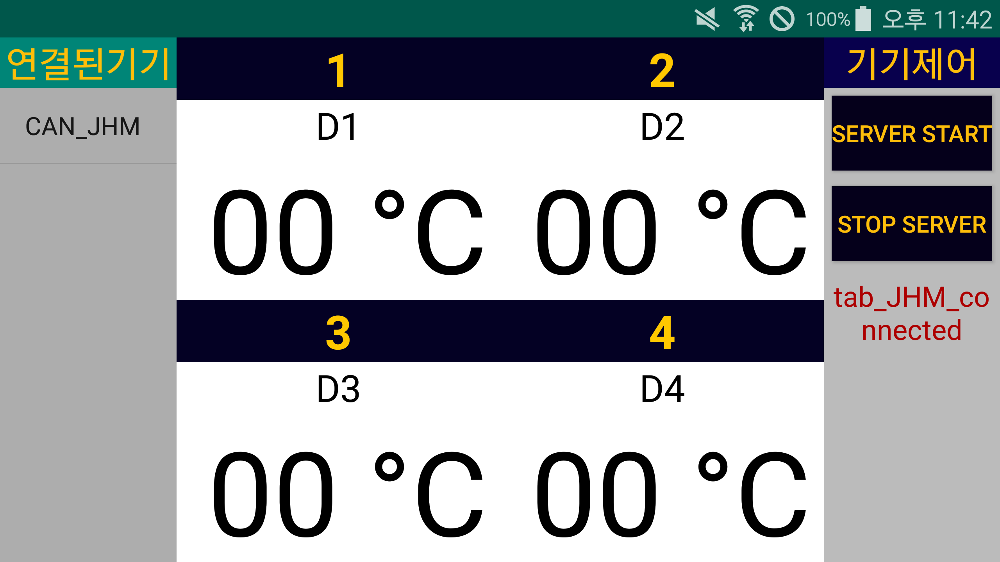
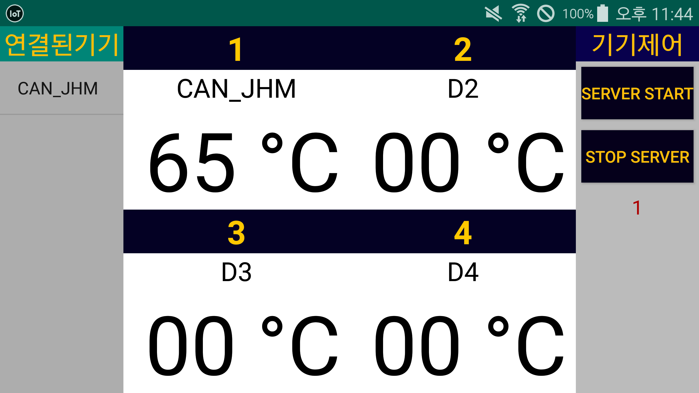
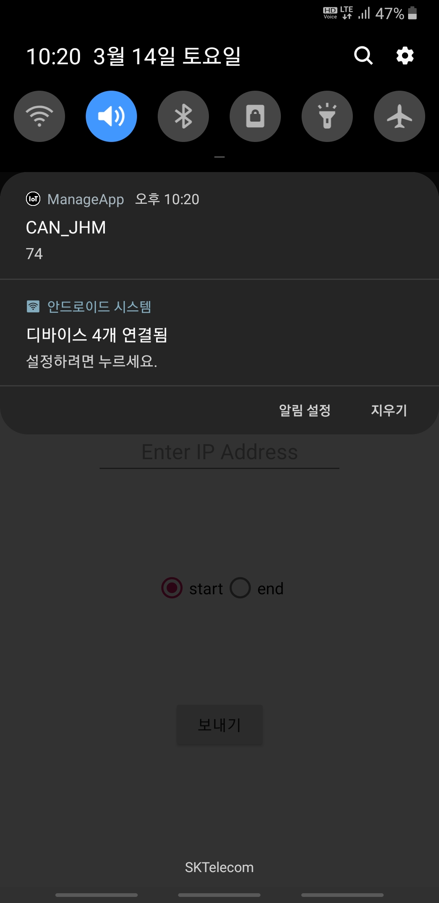
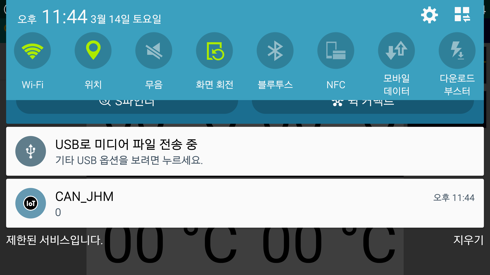

IoT TCP/IP Network(작성중)

   

## 1. 디렉토리 구성도

"깃헙 리퍼지토리에 보여지는 폴더에 대한 설명을 아래에 설명드립니다."

- Network1(프로젝트명: **server**)
  - 서버 코드로 구성되어 있는 자바워크스페이스
  - IoT 기기를 제어하는 안드로이드 기반 프로그램인 pad에게 제어 메세지를 보내고 IoT 기기로 부터 올라오는 데이터(정보)를 서버가 받기위해 구축됨.
  
- Network2(프로젝트명: **client**)
  - 클라이언트 코드로 구성되어 있는 자바워크스페이스
  - IoT 기기 프로그램
- Network3 (프로젝트명: **webspringserver**)
  - 서버의 웹 클라이언트 코드로 구성되어 있는 자바워크스페이스
  - 브라우저를 통해 IoT 기기를 제어하기 위해 구축됨.
  - Network1의 서버를 이용하게 된다.
  
- **pad**
  
  - 안드로이드 코드가 있는 안드로이드 스튜디오 프로젝트 디렉토리
- IoT 기기를 제어하는 안드로이드 기반 프로그램
  
- **ManageApp**

  - 관리자앱 안드로이드 코드가 있는 안드로이드 스튜디오의 프로젝트 디렉토리
  - 웹서버에게 iot기기들을 제어할 수 있는 제어 메세지를 웹서버에게 http 방식으로 보낸다.
    - start -> 1
    - end -> 0
  - 서버가 받은 데이터를 FCM notification 형식으로 받는다.
    - 현재 iot 기기가 발생한 모든 데이터를 ManageApp에 FCM notification으로 보내도록 되어 있다.

   

## 2. 시스템 아키텍처

프로젝트의 여러기기간의 통신에 대해서 아래 그림을 통해 설명 드리겠습니다.

1. **IoT**

   - 여러 IoT 기기들을 의미합니다.
   - IoT 기기들은 CANPro와 연결되어 있는 장비들을 의미합니다.
   - 서버의 제어에 따라 장비들이 제어가 되며 발생된 데이터를 Pad에게 보냅니다.
     - TCP/IP 통신을 사용하여 값을 주고 받습니다.
   - 장비들은 CAN 통신으로 연결되어 있습니다.
   - 각 장비들은 Pad로 부터 값을 보내고 받을 수 있는 Client 프로그램을 가지고 있습니다.

2. **Pad**

   - IoT 기기들을 직접적으로 제어하는 서버의 역할을 하는 안드로이드 기반 앱입니다.
     - pad는 IoT 기기들과 근접한 공간에 설치되어 있을 확률이 높습니다.
   - IoT 기기들로 부터 들어오는 데이터를 받아 화면에서 보여줍니다.
   - 관리자가 IoT 기기 제어를 위해 요청한 값을 받기도 합니다.
     - 현재는 장비를 시작하고 멈추는 제어 메세지와,
     - 장비가 발생하는 데이터가 90 이상인 경우와 20 이하인 경우에 보내는 메세지가 있습니다.
   - 관리자 APP에 IoT 기기에서 발생된 데이터를 보여주기 위해 데이터를 보내기도 합니다.

3. **Server**
   - 서버는 웹서버와 pad 사이에서 데이터를 주고 받을 수 있게 중간다리 역할을 합니다.
   - 양쪽간의 통신은 TCP/IP 방식을 사용합니다.
   - 웹서버와 서버는 TCP/IP 통신을 통해서 값을 전달 받고 
   - 서버와 pad 또한 TCP/IP 통신을 통해 값을 주고 받습니다.
4. **Web Server**
   - 웹서버는 현재 FCM notification 기능을 수행하기 위한 코드로 이루어져 있습니다.
   - HTTP 방식으로 통해 특정 IP 주소로 어떠한 값이 들어오면 그 값을 관리자App 혹은 pad에게 FCM notification을 보냅니다.
   - Notification 기능 뿐만 아니라 브라우저를 통해서 관리자App의 기능과 동일하게 장비를 시작 및 중지하는 메세지를 보낼 수도 있습니다.
     - TCP/IP 방식으로 서버에게 값을 보내도록 프로젝트가 구현되어 있습니다.
5. **ManageAPP**
   - 브라우저를 통해 제어 메세지를 보내는 방법도 가능하나 휴대성을 위해 앱을 통해서 장비들을 제어 하기 위해 구현했습니다.
   - 모든 장비들이 발생하는 데이터는 현재 FCM notification 으로 받게 되어 있습니다.
   - 앱 상에서 장비들을 시작 및 중지하는 제어 메세지를 HTTP 방식으로 웹서버에게 보냅니다.
6. **Firebase Cloud Messaging**
   - 실시간으로 notification을 보낼 수 있습니다.
   - 특정 토큰을 가지고 있는 혹은 특정 주제를 구독을 하고 있는 기기에 Firebase의 서비스를 통해 remoteMessage를 보냅니다.
   - 현재 웹서버에서 장비에서 발생되는 모든 데이터를 ManageApp에 FCM을 통해서 notification을 보내도록 설정되어 있습니다.
     - ManageApp가 구독한 주제: **temperature_manage**
   - 또한 웹서버에서 특정 조건에 해당할 시에 pad에 FCM을 통해 notification을 보내게 되어 있습니다.
     - pad가 구독한 주제: **temperature**

   

# 3. IP 주소 & Port

"현재 프로젝트에 사용되고 있는 IP주소와 Port 번호를 아래에 설명 드립니다."

## 서버

- ip : 15.165.163.102
- port : 8888   

## 패드
- ip: 192.168.43.111
- port: 9999

## 웹서버
- ip : 15.165.163.102
- port
  - 8080
  - 80

# 4. 실행 결과 화면

- 브라우저에서 `http://15.165.163.102/webspringserver` 로 접속하면 뜨는 화면: 

- ManageApp 실행: 

- pad 실행:

- Server 실행 후 pad에 접속 되었는지 확인:

- 장비 접속됨:

- ManageApp에서 모든 장비 시작 제어 메세지 보내기: 

- ManageApp으로 부터 시작 제어 메세지를 받아서 장비가 시작된 화면: 

- ManageApp에 장비들로 부터 발생된 값을 notification으로 받음: 

- data가 특정 조건에 도달하여 웹서버가 pad에게 notificiation을 보냄:
  - 0 : data 가 20 이하인 경우
  - 1 : data 가 90 이상인 경우 

# 5. 제어메세지 규칙

Msg(String id, String txt, String tid)

id => control

txt => message

tid => carId

| txt  |   id   | tid  |      설명      |
| :--: | :----: | :--: | :------------: |
|  1   | engine | car1 |  Engine start  |
|  0   | engine | car1 |  Engine stop   |
|  1   | speed  | car1 |    Speed up    |
|  0   | speed  | car1 |   Speed down   |
|  0   |  cold  | car1 |   Aircon off   |
|  1   |  cold  | car1 | Aircon level 1 |
|  2   |  cold  | car1 | Aircon level 2 |
|  3   |  cold  | car1 | Aircon level 3 |
|  4   |  cold  | car1 | Aircon level 4 |
|  5   |  cold  | car1 | Aircon level 5 |
|  0   |  hot   | car1 |   heater off   |
|  1   |  hot   | car1 | Heater level 1 |
|  2   |  hot   | car1 | Heater level 2 |
|  3   |  hot   | car1 | Heater level 3 |
|  4   |  hot   | car1 | Heater level 4 |
|  5   |  hot   | car1 | Heater level 5 |

