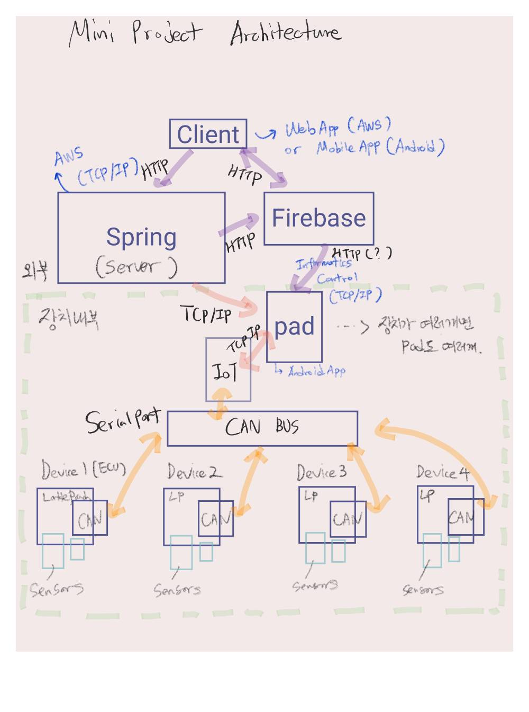

# IoT TCP/IP Network(작성중)

   

## 1. 디렉토리 구성도

"깃헙 리퍼지토리에 보여지는 폴더에 대한 설명을 아래에 설명드립니다."

- Network1
  - 서버 코드로 구성되어 있는 자바워크스페이스
  - IoT 기기를 제어하는 안드로이드 기반 프로그램인 pad에게 제어 메세지를 보내고 IoT 기기로 부터 올라오는 데이터(정보)를 서버가 받기위해 구축됨.
- Network2
  - 클라이언트 코드로 구성되어 있는 자바워크스페이스
  - IoT 기기 프로그램
- Network3
  - 서버의 웹 클라이언트 코드로 구성되어 있는 자바워크스페이스
  - 브라우저를 통해 IoT 기기를 제어하기 위해 구축됨.
  - Network1의 서버를 이용하게 된다.
- pad
  - 안드로이드 코드가 있는 안드로이드 스튜디오 프로젝트 디렉토리
  - IoT 기기를 제어하는 안드로이드 기반 프로그램

- App
  - 관리자앱 안드로이드 코드가 있는 안드로이드 스튜디오의 프로젝트 디렉토리

   

## 2. 시스템 아키텍처

프로젝트의 여러기기간의 통신에 대해서 아래 그림을 통해 설명 드리겠습니다.

1. **IoT**

   - 여러 IoT 기기들을 의미합니다.
   - IoT 기기들은 CAN 통신을 이용한 자동차가 될 수 있고,
   - 여러 센서들이 부착되어 있는 기기들간의 통신이 될 수 있으며,
   - 서버의 제어에 따라 그 IoT 기기들로 부터 발생되는 데이터를 보내게 됩니다.

   

2. **Pad**

   - IoT 기기들을 직접적으로 제어하는 서버의 역할을 하는 안드로이드 기반 앱입니다.
     - pad는 IoT 기기들과 근접한 공간에 설치되어 있을 확률이 높습니다.
   - IoT 기기들로 부터 들어오는 데이터를 받아 화면에서 보여줍니다.
   - 관리자가 IoT 기기 제어를 위해 요청한 값을 받기도 합니다.
   - 관리자 APP에 IoT 기기에서 발생된 데이터를 보내기도 합니다.

   

3. **TCP/IP Server**

   - 관리자 APP을 통해 어떠한 요청값을 보내면 

     

4. **TPC/IP Client**

   - 

5. **Web Server**

   - 

6. **APP**

   - 

7. **Firebase Cloud Messaging**

   - 

